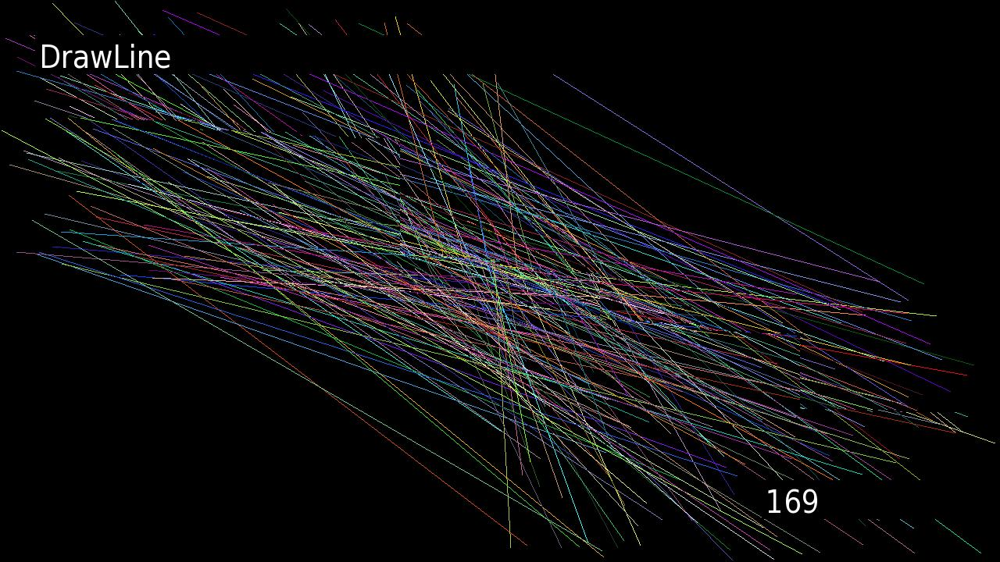

# Roku Draw2d Performance Benchmarking App

Benchmarking App for Roku that runs through a series of visual tests for the Roku.



During each test, the test name will appear in the upper right corner, and the current number of operations per second is displayed in the bottom right corner.

This app will dynamically scale the amount of draw operations to try to match 30 frames per second.

The complete results are printed to the console.

Here's the results for a Roku Ultra:

```
Roku Draw2d Performance Benchmark Tool - v0.1.1
Recursion:  1775ms,  36ms per frame,  200 ops per frame,  5634 ops per second,  2ms avg swap time,  200 ops per frame to reach target
DrawLine:  23451ms,  52ms per frame,  222 ops per frame,  4264 ops per second,  39ms avg swap time,  205 ops per frame to reach target
DrawRect:  4778ms,  47ms per frame,  990 ops per frame,  20929 ops per second,  16ms avg swap time,  990 ops per frame to reach target
DrawPoint:  2930ms,  35ms per frame,  1190 ops per frame,  34130 ops per second,  0ms avg swap time,  1189 ops per frame to reach target
DrawObject (no-Alpha):  6084ms,  57ms per frame,  935 ops per frame,  16437 ops per second,  40ms avg swap time,  712 ops per frame to reach target
DrawObject (with-Alpha):  20486ms,  58ms per frame,  284 ops per frame,  4881 ops per second,  52ms avg swap time,  223 ops per frame to reach target
DrawRotatedObject:  24244ms,  51ms per frame,  208 ops per frame,  4125 ops per second,  37ms avg swap time,  208 ops per frame to reach target
DrawScaledObject:  35724ms,  50ms per frame,  141 ops per frame,  2799 ops per second,  41ms avg swap time,  121 ops per frame to reach target
CreateTempBitmap:  9128ms,  35ms per frame,  38 ops per frame,  1096 ops per second,  0ms avg swap time,  38 ops per frame to reach target
ReuseBitmap:  8808ms,  36ms per frame,  41 ops per frame,  1135 ops per second,  0ms avg swap time,  41 ops per frame to reach target
CreateTempBitmapAndRegion:  9133ms,  35ms per frame,  38 ops per frame,  1095 ops per second,  0ms avg swap time,  38 ops per frame to reach target
ReuseBitmapAndRegion:  8818ms,  36ms per frame,  40 ops per frame,  1134 ops per second,  0ms avg swap time,  40 ops per frame to reach target
CompositorWrap:  15978ms,  52ms per frame,  33 ops per frame,  626 ops per second,  45ms avg swap time,  31 ops per frame to reach target
```

Each line of output contains the following details:

- total time for test
- actual milliseconds per rendered frame
- average test operations per frame
- average operations per second
- average length of time for swapping frames
- result of dynamically scaling the number of operations per second

## Install

```
npm install
```

## Build

```
npm run build
```

This will create the file `./out/roku-draw2d-performance.zip`, that can be sideloaded on a Roku.

## Running from VSCode

1. Run debug configuration `BrightScript Debug: Launch`, and input appropriate details each time you debug,

or,

2. Create a `.env` file at the root of the project. It should look like this:

```
ROKU_USERNAME=rokudev
ROKU_PASSWORD=<password for you roku>
ROKU_HOST=<ip address of your roku>
```

and run debug configuration `BrightScript Debug: Launch from ENV`
